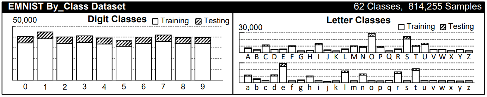

# 7-layer-DNN

세종대학교 소프트웨어학과 19011625 허진수

---

## EMNIST

EMNIST is the Extended version of MNIST, that constitute a more challenging classification tasks 
involving letters and digits, and that shares the same image structure and parameters as the original 
MNIST task, allowing for direct compatibility with all existing classifiers and systems. In this 
assignment, I used EMNIST-ByClass. EMNIST-ByClass represents the most useful organization from 
a classification perspective as it contains the segmented digits and characters arranged by class. 
There are 62 classes comprising [0-9], [a-z] and [A-Z]. The data is also split into a suggested training 
and testing set

---
## 7-layer DNN

In this assignment, I used 7-layer CNN, consists with 2 convolution layers, 2 max pooling layers, 
and 3 linear layers.

The first convolution layer has 3x3 kernel size, which mean extract 3x3 feature in the kernel. And 
stride is 1, so it will extract feature of 28x28x1 image and convert it to 28x28x32(32 is channel size)
size image.

The max pool will reduce the size of the image. It is consistent with 2x2 kernel size and stride is 2. 
So it the size of the image will be 14x14x32.

The second convolution lays has 3x3 kernel size, 1stride and 64 output channel. So the image size 
will be 14x14x64.

The following max pool will reduce the size of the image and the size will be 7x7x64.

The Final 3-layer MLP classify the data. Before put the image data in the fully connected layers, the 
tensor must be flatten. The fully connected layers consist with 3-linear layers [64x7x7 -> 1024], 
[1024 -> 512], [512 -> 62]. Because the EMNIST-ByClass contains 10 digit classes and 52 letter 
classes, the output must be 10+52=62

---
## Training, Testing and Results

I used CrossEntropyLoss as loss function and Adam as optimizer.

### Epoch 15

accuracy: 85.16888

### Epoch 30

accuracy: 84.6762893

It shows that 30-epoch model accuracy is lower than 15-epoch model accuracy. It means the 30-
epoch model is overfitted to the train set
